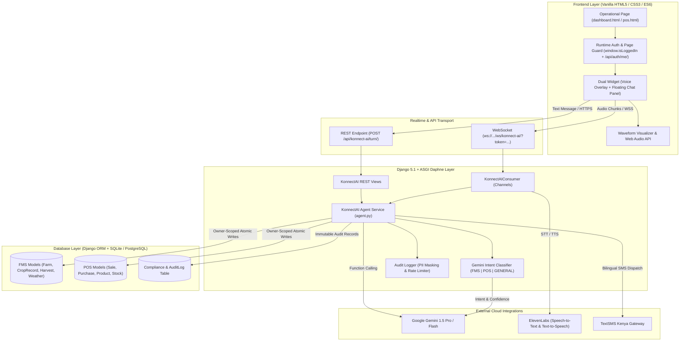
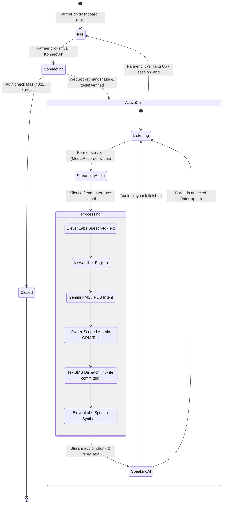

# KonnectAI — Voice and Text Conversational Agent for FarmKonnect

KonnectAI is an intelligent, bilingual (English & Kiswahili), multi-modal agricultural assistant embedded inside the FarmKonnect platform. It empowers Kenyan smallholder farmers to query farm records, manage Point of Sale (POS) operations, track harvests and weather, and receive instant SMS confirmations through speech or text.

---

## 1. System Architecture



---

## 2. Setup & Environment Configuration

### Dependencies
All backend requirements are listed in `backend/requirements.txt`:
- `django==5.1.4`
- `djangorestframework==3.15.2`
- `channels==4.3.2`
- `daphne==4.2.3`
- `google-genai` / `requests` / `urllib3`

Install into your virtual environment:
```bash
cd backend
.\venv\Scripts\activate
pip install -r requirements.txt
```

### Environment Variables
Configure your credentials in `backend/.env` (or copy from `.env.example`):

```ini
# Django Secret Key and Debug
SECRET_KEY=your-django-secret-key
DEBUG=True
ALLOWED_HOSTS=localhost,127.0.0.1

# AI & LLM (Google Gemini)
# Obtain from: https://aistudio.google.com/
GEMINI_API_KEY=your_gemini_api_key_here
GEMINI_MODEL=gemini-1.5-flash

# Voice STT & TTS (ElevenLabs)
# Obtain from: https://elevenlabs.io/
ELEVENLABS_API_KEY=your_elevenlabs_api_key_here
ELEVENLABS_VOICE_ID_EN=21m00Tcm4TlvDq8ikWAM
ELEVENLABS_VOICE_ID_SW=AZnzlk1XvdvUeBnXmlld

# TextSMS Kenya Credentials
# Obtain from: https://sms.textsms.co.ke/
TEXTSMS_API_KEY=your_textsms_api_key
TEXTSMS_PARTNER_ID=your_partner_id
TEXTSMS_SHORTCODE=FarmKonnect

# Channels / Redis Cache (Optional for production cluster)
REDIS_URL=redis://127.0.0.1:6379/0
```

### Migrations & Running the Server
```bash
cd backend
python manage.py migrate
python manage.py runserver
```
*Note: Because `daphne` is in `INSTALLED_APPS` and ASGI is configured in `settings.py`, `python manage.py runserver` automatically starts the Daphne ASGI server, supporting both HTTP and WebSockets simultaneously on `localhost:8000`.*

---

## 3. Voice Call Lifecycle & State Machine



---

## 4. Testing Modalities

### Running Automated Test Suite
The comprehensive automated test suite covers all security, isolation, classification, and consumer requirements:
```bash
cd backend
python manage.py test konnect_ai
```
Test files:
- `konnect_ai/tests/test_classifier.py`: Validates FMS/POS/GENERAL classification, page prior biasing, and <0.6 confidence clarifying question.
- `konnect_ai/tests/test_tools.py`: Validates owner-scoped data isolation across farmers, atomic transaction rollback, and `confirm=True` enforcement.
- `konnect_ai/tests/test_agent.py`: Validates the end-to-end conversational orchestrator, tool execution, SMS dispatch, and Swahili language roundtrip.
- `konnect_ai/tests/test_api.py`: Validates REST endpoints, 401 unauthenticated guard, and 60 turns/hour rate limiting.
- `konnect_ai/tests/test_consumer.py`: Validates Channels WebSocket consumer authentication, `session_start`, `audio_chunk`, and `barge_in`.
- `konnect_ai/tests/test_audit.py`: Validates PII masking (masking phone numbers to last 4 digits), secret scrubbing, and immutable audit logs.

### Testing Voice Mode Locally
1. Log into FarmKonnect in the browser (`http://localhost:8000/login.html`).
2. Navigate to `dashboard.html` or `pos.html`.
3. Click the green **🎙 Call AI** button in the bottom right corner.
4. If `ELEVENLABS_API_KEY` is not provided, the system seamlessly uses the local mock STT and TTS synthesis, allowing you to test the voice call flow without external credentials.
5. Speak or press "Interrupt" to test barge-in.

### Testing Text Mode via cURL

**1. Create a Conversation Session:**
```bash
curl -X POST http://127.0.0.1:8000/api/konnect-ai/sessions/ \
  -H "Authorization: Token YOUR_AUTH_TOKEN" \
  -H "Content-Type: application/json" \
  -d '{"modality": "text", "language": "auto"}'
```

**2. Send a Conversational Turn (Swahili Sale):**
```bash
curl -X POST http://127.0.0.1:8000/api/konnect-ai/turn/ \
  -H "Authorization: Token YOUR_AUTH_TOKEN" \
  -H "Content-Type: application/json" \
  -d '{
    "text": "Nimeuza magunia 10 ya mahindi kwa elfu kumi na tano kwa mteja Alice",
    "page": "pos",
    "language": "sw"
  }'
```

**Response Payload:**
```json
{
  "reply": "Mauzo ya magunia 10 ya mahindi kwa KES 15000 yamerekodiwa kwa mteja Alice.",
  "reply_en": "Recorded sale of 10 bag(s) of mahindi for KES 15000.",
  "intent": "POS",
  "tool_calls": [
    {
      "name": "record_sale",
      "args": {
        "product": "mahindi",
        "quantity": 10,
        "price": 1500,
        "customer": "Alice",
        "confirm": true
      },
      "ok": true,
      "wrote": true,
      "summary": "Recorded sale of 10 bag(s) of mahindi for KES 15000."
    }
  ],
  "sms_sent": true,
  "session_id": 1
}
```

---

## 5. Tool Definitions Summary Table

| Tool Name | Scope | Mode | Description | Write Guard |
| :--- | :--- | :--- | :--- | :---: |
| `get_farmer_profile` | FMS | Read | Returns the farmer's registered profile, county, and farm count. | No |
| `list_farms` | FMS | Read | Lists all farms owned by the authenticated farmer. | No |
| `list_crops` | FMS | Read | Lists crop records across fields owned by the farmer. | No |
| `list_recent_harvests`| FMS | Read | Lists recent harvests and yield amounts. | No |
| `list_open_disease_reports`| FMS | Read | Lists recorded crop or livestock disease logs. | No |
| `get_market_price` | Ref | Read | Queries county commodity price benchmarks. | No |
| `get_weather_history` | Ref | Read | Queries recent rainfall and temperature logs. | No |
| `add_farm` | FMS | Write | Registers a new shamba/farm with size and soil type. | `confirm=True` |
| `add_crop` | FMS | Write | Adds crop plantings to a designated owned farm. | `confirm=True` |
| `log_planting` | FMS | Write | Logs planting dates and seed varieties. | `confirm=True` |
| `log_input` | FMS | Write | Logs fertilizer, pesticide, and manure applications. | `confirm=True` |
| `log_harvest` | FMS | Write | Records harvested yields and units. | `confirm=True` |
| `record_disease` | FMS | Write | Reports crop disease symptoms and affected areas. | `confirm=True` |
| `request_advisory` | Ref | Write | Dispatches an agricultural extension officer advisory request. | `confirm=True` |
| `list_recent_sales` | POS | Read | Lists the farmer's point-of-sale transactions. | No |
| `list_low_stock_products`| POS | Read | Alerts on inventory items with stock beneath threshold. | No |
| `list_customers` | POS | Read | Lists known customer contacts derived from sales. | No |
| `list_recent_purchases`| POS | Read | Lists inventory and farm supply expenditure records. | No |
| `record_sale` | POS | Write | Records a product sale, decrements stock, sends SMS. | `confirm=True` |
| `record_purchase` | POS | Write | Records stock acquisition from a supplier. | `confirm=True` |
| `update_inventory` | POS | Write | Adjusts store inventory levels. | `confirm=True` |

---

## 6. Privacy & Kenyan Data Protection Act Compliance

- **PII Scrubbing**: All phone numbers stored in the `AuditLog` are masked (e.g., `+254***5678` or `*******5678`).
- **Binary Exclusion**: Audio chunks and PCM recordings are never written to database logs or text transcripts.
- **Data Isolation**: All database queries enforce `farmer=user.farmer_profile` directly within the ORM scope; cross-tenant leakage is architecturally impossible.
- **Audit Retention**: Data Protection Act 90-day retention policies are automated via `purge_old_audit_logs()`.
